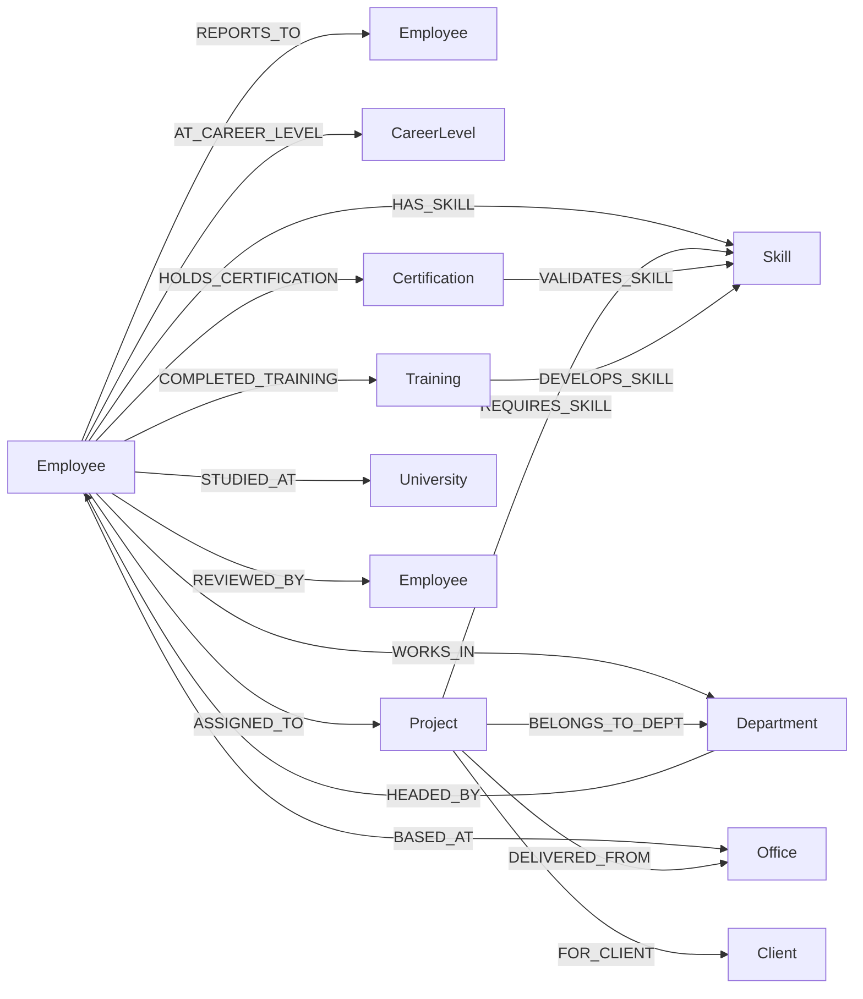
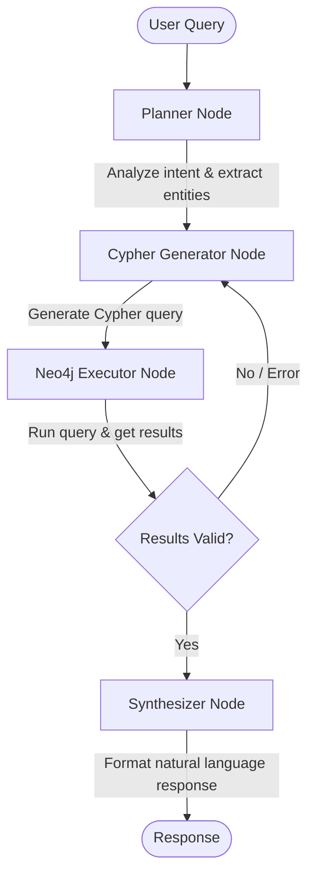

# Org Employee GraphRAG — Architecture & Implementation Plan

## Overview

Build a **Graph-based RAG (GraphRAG)** system that ingests organizational employee data from an Excel file into **Neo4j**, then enables natural language queries like _"I want people with Python skills who have worked on AI projects with AWS certifications"_ using **LangChain**, **LangGraph**, and a multi-provider LLM factory.

---

## 1. Data Analysis Summary

The source Excel has **13 sheets** with the following key entities:

| Sheet | Rows | Purpose |
|---|---|---|
| **Employees** | 151 | Core employee profiles (31 columns) |
| **Employee Skills** | 935 | Employee ↔ Skill mappings with proficiency |
| **Projects** | 15 | Project details with clients & industry |
| **Project Assignments** | 285 | Employee ↔ Project role assignments |
| **Project Skills** | 76 | Skills required per project |
| **Certifications** | 107 | Employee certifications |
| **Performance Reviews** | 313 | Annual reviews & ratings |
| **Training Records** | 453 | Training completions |
| **Career Levels** | 12 | L1-L12 hierarchy definitions |
| **Departments** | 10 | Department & service line structure |
| **Offices** | 10 | Office locations (India + global) |
| **Skills Catalog** | 40 | Skill definitions with categories |
| **Org Summary** | — | Dashboard (skip for ingestion) |

---

## 2. Neo4j Graph Schema

### 2.1 Node Types (10)

```
(:Employee)       — 151 nodes, 20+ properties
(:Skill)          — 40 nodes (from Skills Catalog)
(:Project)        — 15 nodes
(:Department)     — 10 nodes
(:Office)         — 10 nodes
(:CareerLevel)    — 12 nodes
(:Certification)  — ~30 unique cert types
(:Training)       — ~25 unique training programs
(:Client)         — ~15 unique clients
(:University)     — ~40 unique universities
```

### 2.2 Relationship Types (15)



### 2.3 Detailed Relationship Properties

| Relationship | Properties |
|---|---|
| `HAS_SKILL` | proficiency_level, years_experience, is_primary, assessment_type, last_used_date |
| `ASSIGNED_TO` | role_on_project, start_date, end_date, allocation_pct, billing_rate, total_hours, is_billable, performance |
| `HOLDS_CERTIFICATION` | issue_date, expiry_date, status, certificate_no |
| `COMPLETED_TRAINING` | start_date, end_date, duration_hrs, status, score, is_mandatory |
| `REVIEWED_BY` | review_year, review_period, overall_rating, goals_score, competency_score, weighted_avg, promotion_eligible, increment_pct, bonus_pct |
| `REPORTS_TO` | _(no properties)_ |
| `REQUIRES_SKILL` | importance_level |
| `VALIDATES_SKILL` | _(no properties)_ |
| `DEVELOPS_SKILL` | _(no properties)_ |

### 2.4 Key Node Properties

#### Employee
```
employee_id, first_name, last_name, full_name, gender, date_of_birth,
nationality, designation, employee_band, work_email, personal_email,
work_phone, mobile, date_of_joining, employment_type, employment_status,
education_level, degree, annual_ctc_lpa, currency, notice_period,
work_mode, cost_center, years_at_company, total_exp_yrs
```

#### Project
```
project_id, project_name, project_code, project_type, status,
start_date, planned_end_date, project_value_inr, currency, industry_vertical
```

---

## 3. System Architecture

```
┌─────────────────────────────────────────────────────────┐
│                    Streamlit Chat UI                      │
│              (Natural Language Input/Output)              │
└────────────────────────┬────────────────────────────────┘
                         │
                         ▼
┌─────────────────────────────────────────────────────────┐
│                   LangGraph Agent                        │
│   ┌──────────┐  ┌───────────┐  ┌─────────────────┐     │
│   │ Planner  │→ │  Cypher   │→ │   Synthesizer   │     │
│   │  Node    │  │ Generator │  │     Node        │     │
│   └──────────┘  └─────┬─────┘  └────────┬────────┘     │
│                       │                  │               │
│                       ▼                  │               │
│              ┌─────────────┐             │               │
│              │  Neo4j      │             │               │
│              │  Executor   │─────────────┘               │
│              └─────────────┘                             │
└─────────────────────────────────────────────────────────┘
                         │
              ┌──────────┼──────────┐
              ▼          ▼          ▼
         ┌────────┐ ┌────────┐ ┌────────┐
         │  Groq  │ │ Gemini │ │ OpenAI │
         └────────┘ └────────┘ └────────┘
                (LLM Factory)
```

### 3.1 LangGraph Agent Flow



**Nodes:**
1. **Planner Node** — Understands user intent, extracts entities (skills, certifications, project types), determines query strategy
2. **Cypher Generator Node** — Converts plan into valid Cypher query using schema context + few-shot examples
3. **Neo4j Executor Node** — Executes Cypher against Neo4j, handles errors
4. **Synthesizer Node** — Formats raw graph results into natural language response with tables/lists

---

## 4. Project Structure

```
Org_Employee_GraphRAG/
├── Source Input/
│   └── accenIndia_org_model.xlsx
├── src/
│   ├── __init__.py
│   ├── config.py                 # Settings, env loading
│   ├── llm_factory.py            # Multi-provider LLM factory
│   ├── data_loader.py            # Excel → DataFrames
│   ├── neo4j_manager.py          # Neo4j connection & operations
│   ├── ingestion/
│   │   ├── __init__.py
│   │   └── ingest_graph.py       # DataFrame → Neo4j ingestion
│   ├── graph_rag/
│   │   ├── __init__.py
│   │   ├── schema.py             # Graph schema definitions
│   │   ├── cypher_templates.py   # Few-shot Cypher examples
│   │   ├── prompts.py            # System prompts for each node
│   │   └── agent.py              # LangGraph agent definition
│   └── utils/
│       ├── __init__.py
│       └── logger.py             # Logging setup
├── app.py                        # Streamlit chat application
├── ingest.py                     # CLI entry point for data ingestion
├── requirements.txt
├── .env.example
└── README.md
```

---

## 5. Implementation Steps

### Phase 1: Foundation
1. Initialize project structure and install dependencies
2. Create `.env.example` and `config.py`
3. Build `llm_factory.py` — factory pattern supporting Groq, Gemini, OpenAI via env var `LLM_PROVIDER`

### Phase 2: Data Ingestion
4. Build `data_loader.py` — reads Excel, returns clean DataFrames per sheet
5. Build `neo4j_manager.py` — connection manager with CRUD operations
6. Build `ingest_graph.py` — creates constraints/indexes, upserts all nodes and relationships
7. Create `ingest.py` CLI entry point

### Phase 3: GraphRAG Agent
8. Define `schema.py` — graph schema text for LLM context
9. Create `cypher_templates.py` — few-shot Cypher examples for common query patterns
10. Write `prompts.py` — system prompts for Planner, Cypher Generator, Synthesizer
11. Build `agent.py` — LangGraph StateGraph with all nodes and edges

### Phase 4: Chat UI
12. Build `app.py` — Streamlit chat interface with conversation history

### Phase 5: Testing & Polish
13. Run ingestion and verify graph in Neo4j
14. Test with sample queries
15. Add error handling and logging

---

## 6. LLM Factory Design

```python
# Usage:
# LLM_PROVIDER=groq      → uses Groq (llama/mixtral)
# LLM_PROVIDER=gemini     → uses Google Gemini
# LLM_PROVIDER=openai     → uses OpenAI GPT

llm = get_llm()  # Returns appropriate ChatModel based on .env
```

| Provider | Env Vars Required | Default Model |
|---|---|---|
| `groq` | `GROQ_API_KEY` | `llama-3.3-70b-versatile` |
| `gemini` | `GOOGLE_API_KEY` | `gemini-2.0-flash` |
| `openai` | `OPENAI_API_KEY` | `gpt-4o-mini` |

---

## 7. Key Cypher Query Patterns

### Find employees by skill + certification + project type
```cypher
MATCH (e:Employee)-[hs:HAS_SKILL]->(s:Skill {name: 'Python'})
WHERE hs.proficiency_level IN ['Advanced', 'Expert']
MATCH (e)-[:HOLDS_CERTIFICATION]->(c:Certification)
WHERE c.name CONTAINS 'AWS'
MATCH (e)-[a:ASSIGNED_TO]->(p:Project)
WHERE p.industry_vertical = 'Banking & Financial Services'
RETURN e.full_name, e.designation, s.name, hs.proficiency_level,
       c.name AS certification, p.project_name, a.role_on_project
```

### Find available employees with specific skills
```cypher
MATCH (e:Employee {employment_status: 'Active'})-[hs:HAS_SKILL]->(s:Skill)
WHERE s.name IN ['Python', 'Machine Learning']
AND hs.proficiency_level IN ['Advanced', 'Expert']
OPTIONAL MATCH (e)-[a:ASSIGNED_TO]->(p:Project {status: 'Active'})
WITH e, collect(DISTINCT s.name) AS skills, sum(COALESCE(a.allocation_pct, 0)) AS current_allocation
WHERE current_allocation < 100
RETURN e.full_name, e.designation, skills, current_allocation
ORDER BY current_allocation ASC
```

---

## User Review Required

> [!IMPORTANT]
> **Neo4j Connection**: This plan assumes you have a Neo4j instance running (local or Aura). Please confirm:
> 1. Do you have Neo4j installed locally, or should I use Neo4j Aura (cloud)?
> 2. What are your Neo4j connection details (URI, username, password)?

> [!IMPORTANT]
> **LLM Provider**: Which provider would you like to use as the default?
> - Groq (free, fast, uses Llama models)
> - Gemini (Google)
> - OpenAI

> [!NOTE]
> The **Org Summary** sheet is a dashboard-style sheet without structured data. I'll skip it during ingestion.

## Open Questions

1. **Chat UI**: I'll use **Streamlit** for the chat interface — does that work for you, or would you prefer something else (FastAPI + HTML, Gradio, etc.)?
2. **Performance Reviews as relationships vs nodes**: Currently planned as a `REVIEWED_BY` relationship with properties. Should performance reviews be their own node for richer querying?

## Verification Plan

### Automated Tests
- Run `ingest.py` and verify node/relationship counts match source data
- Execute sample Cypher queries to confirm data integrity
- Test the LangGraph agent with 5+ diverse natural language queries

### Manual Verification
- Visually verify the graph in Neo4j Browser
- Test edge cases (ambiguous queries, no-results scenarios)
