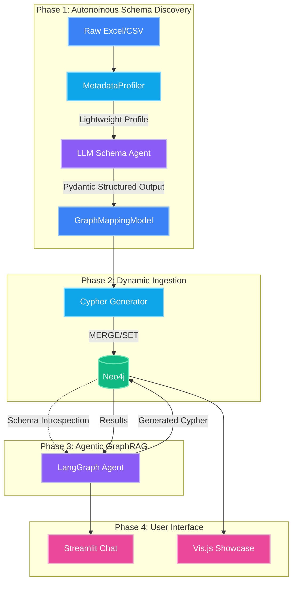

# Finding the Needle in the Enterprise Haystack: Building a Fully Agentic Talent Knowledge Graph

The modern enterprise operates on a crippling paradox: we have more data about our global workforce than ever before, yet finding the perfect person for a critical project remains nearly impossible. Your master HR data sits in Workday, project allocations are locked in Jira, technical proficiencies are scattered across LinkedIn, and vital certifications languish in legacy training portals.

And yet, when a high-priority AI project lands and the delivery lead asks:

> _"Who in our Bangalore or Pune office has Advanced-level Python, holds an AWS certification, has worked on Banking projects before, and isn't fully allocated right now?"_

Nobody can answer that question in under a week. The data exists — it's just buried in disconnected silos that can't reason about _relationships_.

I built **OrgGraph AI** to solve exactly this. It's a Fully Agentic system that takes raw organizational data (any Excel or CSV), autonomously discovers the graph schema using LLMs, ingests it into Neo4j, and powers a natural language conversational interface — all without a single line of hardcoded domain logic.

Here's how I built it, and why this architecture matters.

---

## The Real Problem: Relationships, Not Records

Traditional HR tools are built on flat SQL tables. They're great at answering _"Show me all employees in Bangalore"_ or _"List everyone with Python on their profile."_ But they fundamentally fail at **intersectional queries** — questions that require traversing relationships across multiple dimensions simultaneously.

Consider what a Knowledge Graph unlocks:

**1. Precision Project Staffing**
Find the exact person who satisfies Skill A + Certification B + Location C + Available bandwidth — all in one query traversal, not four separate database joins.

**2. Identifying Skill Gaps Before They Become Bottlenecks**
Map current employee skills against upcoming project requirements. Discover that your Data & AI division lacks enough Kubernetes expertise for the Q3 pipeline before it's too late.

**3. Succession Planning & Cross-Silo Collaboration**
Pair a junior developer in Sydney with a senior architect in the same region based on overlapping tech stacks. Find internal domain experts for quick consulting instead of hiring external contractors.

**4. Organizational Network Analysis**
Visualize reporting chains, identify single points of failure in management hierarchies, and detect over-allocated star performers before they burn out.

These aren't hypothetical use-cases. The dataset I used for OrgGraph AI contains **151 employees across 13 interconnected data tables** — including 935 skill mappings, 285 project assignments, 107 certifications, 313 performance reviews, and 453 training records across 10 departments and 10 global offices.

---

## Why "Zero-Hardcoding" Changes Everything

Here's the dirty secret of most Knowledge Graph projects: the schema is hardcoded.

A data engineer looks at the Excel file, manually decides _"Employees are nodes, Skills are nodes, HAS_SKILL connects them,"_ writes specific Cypher queries for each entity, and ships it. The moment the HR team adds a `Certifications` sheet, or renames `PrimarySkill` to `TechStack`, the pipeline breaks.

OrgGraph AI takes a fundamentally different approach. **The LLM decides what the schema should be.** You drop in any tabular file, and the system autonomously:

1. **Profiles** the data (column types, cardinality, foreign key candidates)
2. **Infers** a graph schema via Pydantic-validated structured LLM output
3. **Generates and executes** Cypher MERGE queries dynamically
4. **Introspects** the resulting graph to power a natural language chat agent

Zero human mapping. Zero hardcoded Cypher. You could swap the HR dataset for supply-chain logistics data tomorrow and the same codebase would build a completely different Knowledge Graph.

---

## Architecture Overview

The system spans four phases, orchestrated with Python, LangChain, LangGraph, Pydantic, and Neo4j:



Let's walk through each phase with actual implementation details.

---

## Phase 1: The Metadata Profiler

Before the LLM sees anything, the `MetadataProfiler` analyzes the raw data locally and produces a compressed structural fingerprint. This is a critical privacy decision: **the LLM never sees actual employee data** — only column names, data types, cardinality statistics, and sample values.

The profiler's most important feature is **automatic Foreign Key detection**. It identifies potential FK relationships by checking if the values in one column are a subset of a primary key column in another table:

```python
# Simplified FK detection logic from profiler.py
overlap = col_values & ref_values
if len(overlap) / len(col_values) >= 0.8:
    fk_candidates.append({
        "source_table": tname,
        "source_column": col,
        "target_table": ref_table,
        "target_column": ref_col,
        "match_pct": round(len(overlap) / len(col_values) * 100, 1),
    })
```

For example, it automatically discovers that `Manager_Employee_ID` in the Employees table is an 80%+ match with `Employee_ID` — suggesting a self-referencing `REPORTS_TO` relationship. This hint is passed to the LLM, which would otherwise have no way to infer hierarchical relationships from flat column names.

---

## Phase 2: LLM Schema Discovery via Pydantic

The profiler output is sent to an LLM (configurable: OpenAI GPT-4o, Google Gemini, or Groq) prompted to act as a Principal Graph Database Architect.

The key engineering decision here: **LLMs output free-form text, but graph databases need absolute structure.** To bridge this gap, I use LangChain's `with_structured_output()` to force the LLM to return a validated Pydantic model:

```python
# The LLM is coerced to return this exact structure
class GraphMappingModel(BaseModel):
    nodes: List[NodeMapping]           # What becomes a Node?
    relationships: List[RelationshipMapping]  # What becomes an Edge?
    notes: str                         # LLM's reasoning notes

class NodeMapping(BaseModel):
    label: str                   # e.g., "Employee"
    source_table: str            # e.g., "Employees"
    primary_key_column: str      # e.g., "Employee_ID"
    properties: List[PropertyMapping]  # All columns to map

class RelationshipMapping(BaseModel):
    type: str                    # e.g., "HAS_SKILL"
    from_node_label: str         # e.g., "Employee"
    to_node_label: str           # e.g., "Skill"
    from_key_column: str         # FK column in source table
    to_key_column: str           # PK column of target node
    properties: List[PropertyMapping]  # Edge properties
```

This `GraphMappingModel` is the **architectural contract** of the entire system. The Schema Agent produces it; the Dynamic Ingestion Engine consumes it. If the Pydantic validation fails, the LLM is asked again — no malformed schema ever reaches Neo4j.

---

## Phase 3: Dynamic Cypher Ingestion

With a validated schema in hand, the ingestion engine translates it into parameterized Cypher queries on the fly. No templates. No switch-case for different entity types. The engine reads the `GraphMappingModel` and dynamically constructs `MERGE` + `SET` statements for every node and relationship type:

```python
# Dynamically generated Cypher from the mapping — zero hardcoding
UNWIND $rows AS row
MERGE (n:Employee {employee_id: row.employee_id})
SET n.full_name = row.full_name,
    n.designation = row.designation,
    n.date_of_joining = row.date_of_joining,
    n.annual_ctc_lpa = toFloat(row.annual_ctc_lpa)
```

Because the LLM-inferred schema specifies primary keys, the engine uses `MERGE` (not `CREATE`) — making the entire pipeline **idempotent**. Running it three times on the same data produces the exact same graph with zero duplicates. The engine also handles type casting (`toInteger()`, `toFloat()`), NaN → None conversions, and skips rows with null primary keys automatically.

---

## Phase 4: The Agentic GraphRAG Chat

This is where the "Fully Agentic" label truly earns itself. The conversational AI isn't just a text-to-Cypher translator — it's a **4-node LangGraph state machine** with built-in error recovery:

```
User Question
    ↓
┌─────────────┐
│   Planner   │ → Analyzes intent, extracts entities, maps to schema
└──────┬──────┘
       ↓
┌─────────────┐
│  CypherGen  │ → Generates Cypher query using schema + few-shot examples
└──────┬──────┘
       ↓
┌─────────────┐     ┌─── Error? ───→ Retry CypherGen (up to 2x)
│  Executor   │ ────┤
└──────┬──────┘     └─── Success ──→
       ↓
┌──────────────┐
│ Synthesizer  │ → Formats raw graph data into natural language
└──────────────┘
```

Three things make this agent truly dynamic:

**1. Runtime Schema Introspection.** At startup, the agent queries Neo4j for its live schema — node types, relationship types, properties, and connection patterns. This schema is injected directly into every prompt. The agent never assumes what's in the database.

**2. Self-Generated Few-Shot Examples.** Most GraphRAG systems hardcode Cypher examples. OrgGraph AI uses the LLM itself to generate few-shot examples *from the live schema and sampled data*. When the schema changes (new data upload), the few-shots regenerate automatically.

**3. Error-Aware Retry.** When a generated Cypher query fails execution, the error message is fed back into the CypherGen node, which corrects the query and retries — up to 2 times. This makes the agent remarkably robust against edge-case syntax errors.

---

## Enterprise-Grade Design Decisions

### Data Privacy
The LLM never sees raw employee data. The profiler extracts only structural metadata (column names, data types, cardinality stats). The actual PII stays on your server.

### Provider Agnosticism
An `LLM Factory` pattern lets you switch between OpenAI, Google Gemini, or Groq by changing a single environment variable:

```python
# .env: LLM_PROVIDER=gemini | openai | groq
llm = get_llm()  # Returns the configured ChatModel
```

No code changes needed. No vendor lock-in.

### Resilience to Messy Data
Corporate Excel sheets are never clean. The ingestion engine handles trailing whitespace, mixed date formats, unexpected NaN values, and null primary keys — automatically skipping or converting problematic rows rather than crashing the pipeline.

---

## The Result: From Upload to Insight in Minutes

The operational interface is a **Streamlit dashboard** where users upload any Excel/CSV file in the sidebar and watch the pipeline execute in real-time: profiling → schema discovery → ingestion → agent initialization. Then they simply chat.

To showcase the technology, I also built a **cinematic portfolio demo** using Vis.js (physics-based graph rendering) and GSAP (scroll-triggered animations). The showcase features:

- **Staged Physics Reveal**: Graph nodes load organically with gravity and repulsion forces
- **Interactive Detail Panel**: Click any node to see its properties and connected relationships
- **Live Query Simulation**: A chat interface showing both the natural language answer and the Cypher query generated under the hood

---

## The Bigger Picture

OrgGraph AI isn't just an HR tool. The architecture is **domain-agnostic by design**. The same codebase could build a Knowledge Graph for:

- **IT Asset Management** — Map servers, applications, teams, and dependencies
- **Supply Chain** — Track suppliers, materials, warehouses, and logistics routes
- **Research Networks** — Connect researchers, papers, institutions, and funding sources

We're entering an era where data pipelines adapt to the data, rather than engineers wrestling data into rigid schemas. Agentic architectures like this are the blueprint.

**Ready to build your own?**

- 💻 **[Explore the OrgGraph AI source code on GitHub](https://github.com/shubhamshardul-work/Projects/tree/main/Fully_Agentic_Org_Employee_GraphRAG)**
- 🤝 **[Let's discuss your use-case](mailto:shubham.shardul.work@gmail.com)**
