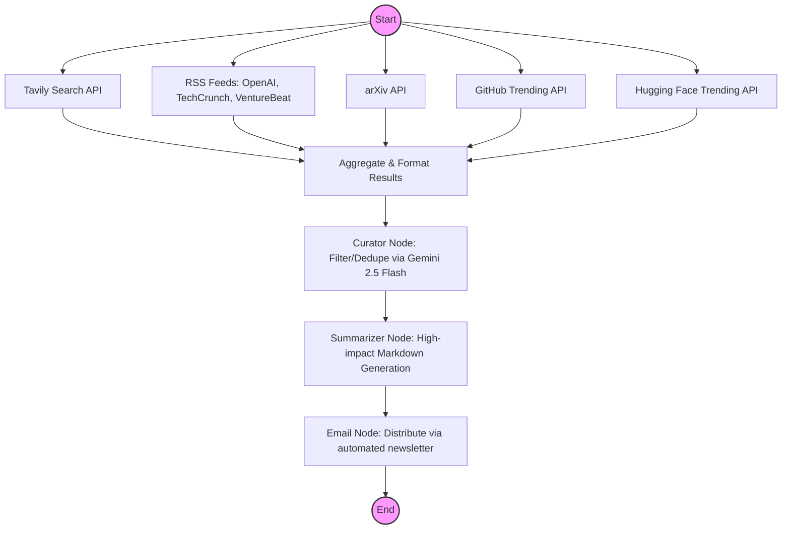

# GenAI News Fetcher

An automated, high-precision agent powered by **LangGraph** that curates and summarizes the top news in Generative AI daily. 

This agent doesn't just search the web; it performs a multi-source deep dive across specialized portals to ensure you never miss a breakthrough. It uses **Google's Gemini (2.5 Flash)** models to filter, select, and report on the most impactful advancements with strict recency enforcement.

## ✨ Key Features

- **Multi-Source Fetching**: Autonomously scrapes data from Tavily Search, **RSS feeds (OpenAI, TechCrunch, VentureBeat)**, ArXiv AI papers, GitHub Trending repos, and Hugging Face Trending models.
- **Parallel Execution**: Uses LangGraph's fan-out/fan-in pattern to fetch all sources simultaneously for maximum efficiency.
- **Strict Recency Control**: Configurable filtering (default 2 days) to ensure results are always fresh.
- **Deduplication & Curation**: Intelligent LLM-based curation that merges related stories and rejects low-impact "noise."
- **Full State Transparency**: Automatically saves the complete execution state as a structured JSON file alongside the Markdown report.

## 🚀 How It Works



## 🛠 Local Development

1. **Clone the repository**
2. **Install dependencies**: `pip install -r requirements.txt`
3. **Environment Setup**: Create a `.env` file in the root with your API keys:
   ```env
   GOOGLE_API_KEY=your_key_here
   TAVILY_API_KEY=your_key_here
   ```
4. **Run the agent**:
   ```bash
   # Standard run (default 2 days)
   python main.py
   
   # Custom recency window (e.g., last 24 hours)
   python main.py --days 1
   ```

## 📦 Output
- **`reports/`**: Human-readable Markdown reports (e.g., `genai_news_YYYY-MM-DD_HH-MM-SS.md`).
- **`state/`**: Full JSON state dump of all raw and curated findings for developers.

## 🤖 GitHub Actions Deployment

The agent is pre-configured to run automatically every day at 8:00 AM UTC.

1. Go to repository **Settings** > **Secrets and variables** > **Actions**.
2. Add `GOOGLE_API_KEY` and `TAVILY_API_KEY` as repository secrets.
3. Enable workflows in the **Actions** tab.
4. The action will generate and commit the reports directly to your repo.
