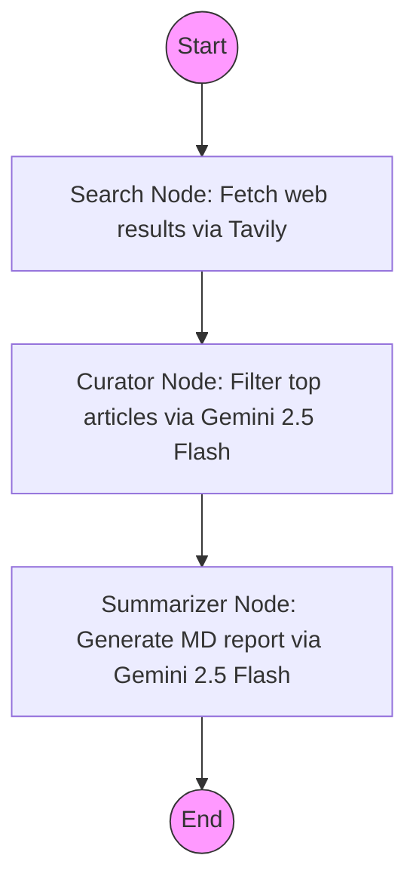

# GenAI News Fetcher

An automated agent powered by LangGraph that curates and summarizes the top news in Generative AI daily.
It uses Tavily to search the web and Google's Gemini models to filter, select, and report on the most impactful advancements.
The results are outputted to the `reports/` directory.

## How It Works



## Local Development

1. Clone the repository
2. Install dependencies: `pip install -r requirements.txt`
3. Create a `.env` file in the root with your API keys:
   ```
   GOOGLE_API_KEY=your_key_here
   TAVILY_API_KEY=your_key_here
   ```
4. Run the script: `python main.py`

## GitHub Actions Deployment

The agent is pre-configured to run automatically every day at 8:00 AM UTC via GitHub Actions.

To enable this on your fork/repo:
1. Go to your GitHub repository **Settings** > **Secrets and variables** > **Actions**
2. Click **New repository secret**
3. Add `GOOGLE_API_KEY` with your Google Gemini API key
4. Add `TAVILY_API_KEY` with your Tavily API key
5. Go to the **Actions** tab and enable workflows
6. You can manually trigger the workflow by selecting `Generate GenAI News Report` and clicking **Run workflow**.

The action will generate the markdown report and push it to the `reports/` folder in your repository.
