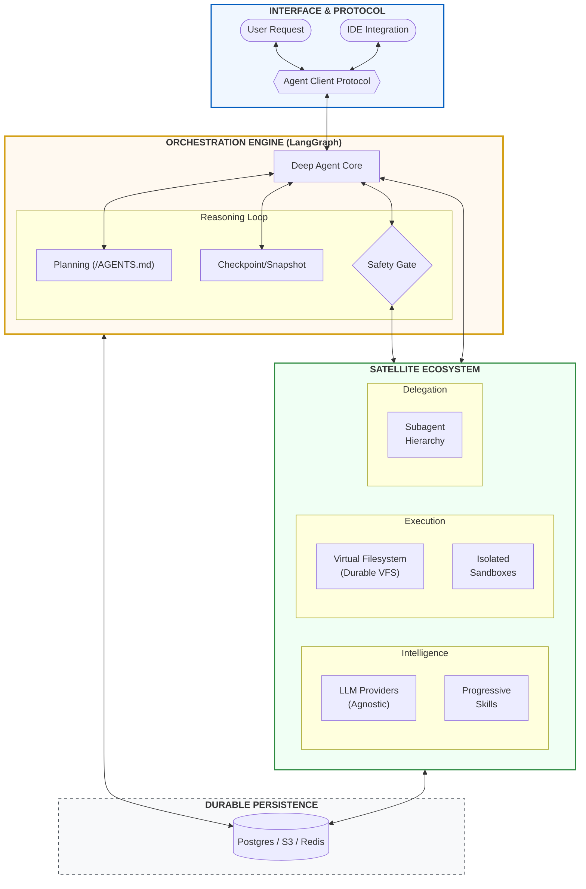
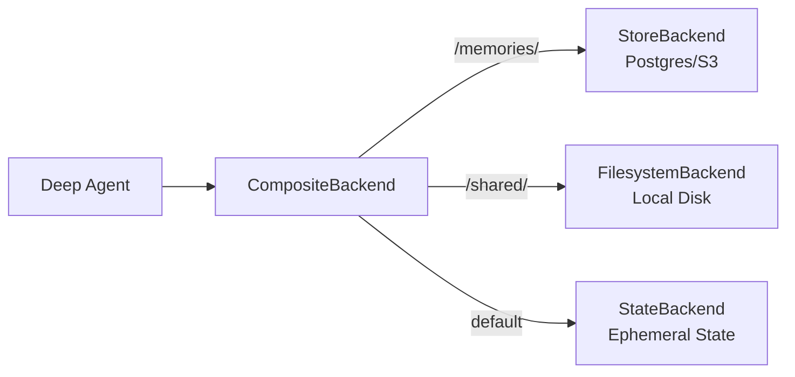
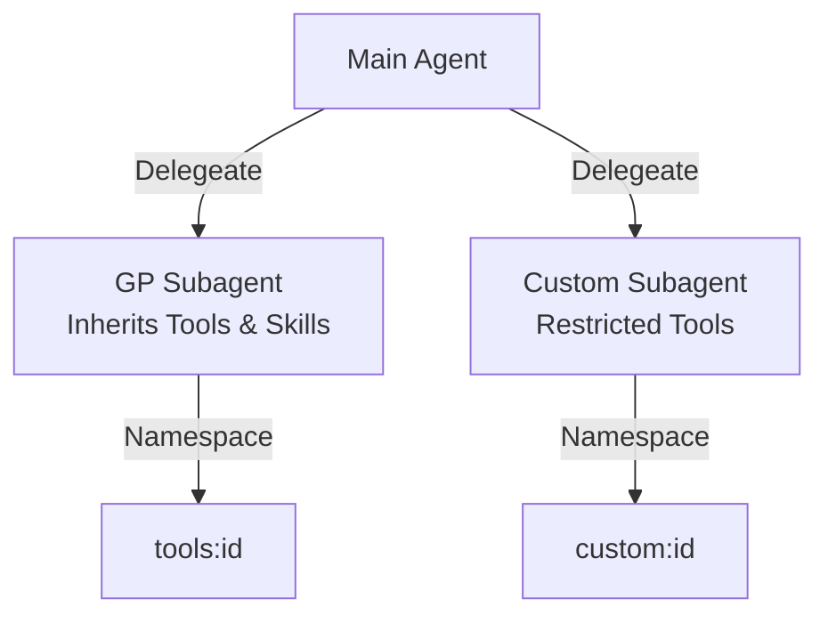
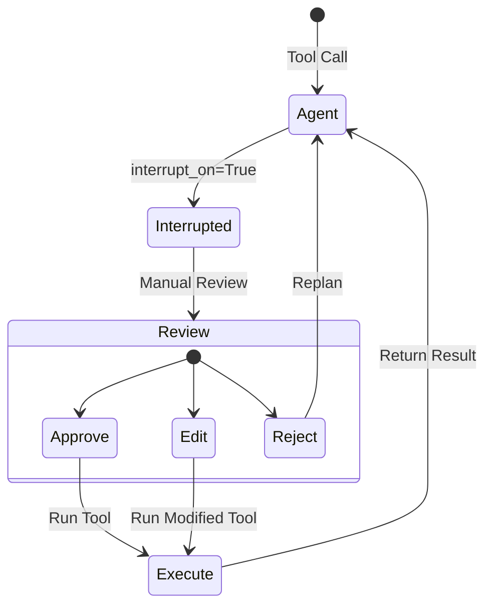
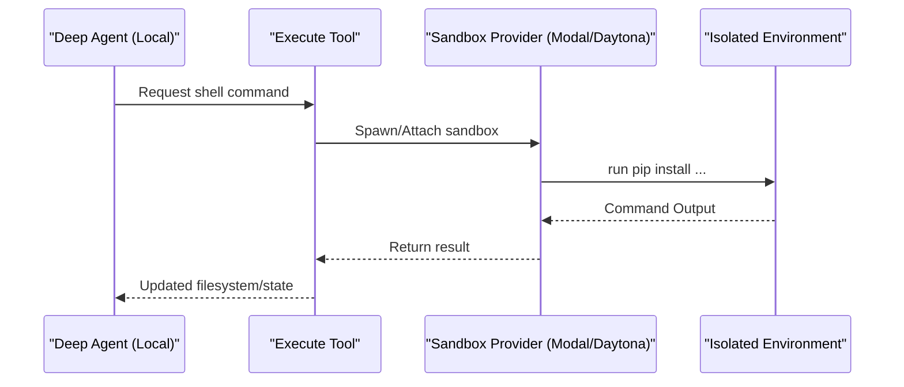
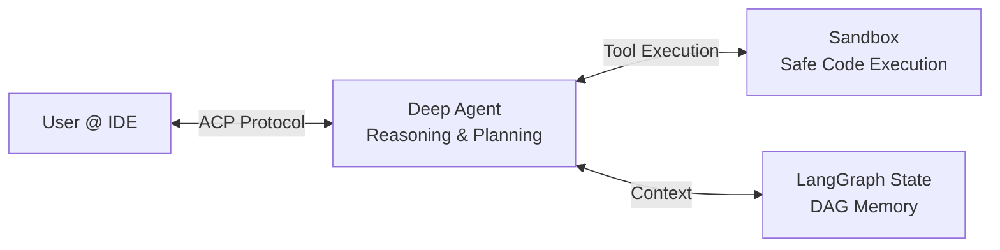

# Deep Agents — Chapter 3: Everything Claude Agent can do plus MORE?

LangChain's **Deep Agents** framework is revolutionizing how we build autonomous, long-running, and highly capable AI agents. By wrapping around LangGraph, Deep Agents provides a robust suite of tools right out of the box—ranging from virtual filesystems to sandboxed execution and hierarchical subagent delegation.

In this comprehensive guide, we'll explore the core pillars that make Deep Agents an essential tool for your AI development stack.



---

## 1. Quickstart: From Simple Prompts to Autonomous Plans

Getting started with Deep Agents is about more than just calling an LLM; it's about initializing an autonomous environment. To get the research agent running, you simply need to set your `ANTHROPIC_API_KEY` (and `TAVILY_API_KEY` for search). In just a few lines, you can build an agent that doesn't just respond—it **plans**. 

The transition from a "Zero-to-Hero" research script to a production-ready setup is seamless. Deep Agents automatically decompose complex requests into a series of actionable steps (To-Dos), utilizing a virtual filesystem to manage project context without drowning the LLM in tokens.

```python
import os
from deepagents import create_deep_agent
from langchain_community.tools.tavily_search import TavilySearchResults

# 1. Provide your API keys in the environment
# os.environ["ANTHROPIC_API_KEY"] = "sk-..." 
# os.environ["TAVILY_API_KEY"] = "tvly-..."

# 2. create_deep_agent initializes the planning harness and virtual filesystem
agent = create_deep_agent(
    tools=[TavilySearchResults(max_results=5)],
    system_prompt="You are a senior technical researcher. Create a structured report with citations."
)

# 3. The agent creates a plan, searches the web, and synthesizes findings
result = agent.invoke({
    "messages": [{"role": "user", "content": "Research the current state of Model Context Protocol (MCP)"}]
})

print(result["messages"][-1].content)
```

---

## 2. Customizing Your Deep Agent

At its core, `create_deep_agent` is designed for ultimate flexibility. While the default configuration gives you a highly capable agent out of the box (using `claude-sonnet-4-6` and an ephemeral `StateBackend`), you can tailor almost every aspect of its behavior to fit your exact enterprise requirements.

The `create_deep_agent` function supports extensive configuration:
- **Model Selection:** Swap between Anthropic, OpenAI, Azure, Gemini, AWS Bedrock, or Hugging Face seamlessly.
- **Connection Resilience:** Automatically retry API requests with exponential backoff on flaky networks.
- **System Prompts:** Steer your agent with domain-specific instructions that append cleanly to the underlying Deep Agent prompt.
- **Middleware:** Inject powerful interceptions into the agent's lifecycle. Deep agents come loaded with helpful pre-built middleware like `SummarizationMiddleware`, `HumanInTheLoopMiddleware`, or `SubAgentMiddleware`. You can also write entirely custom middleware hooks. 

Here is a glimpse of how you can customize a Deep Agent beyond the defaults:

```python
from langchain.tools import tool
from langchain.agents.middleware import wrap_tool_call
from deepagents import create_deep_agent

@tool
def get_weather(city: str) -> str:
    """Get the weather in a city."""
    return f"The weather in {city} is sunny."

@wrap_tool_call
def log_tool_calls(request, handler):
    """Custom middleware to intercept and log every tool call."""
    print(f"[Middleware] Tool called: {request.name}")
    # Proceed to execute the tool
    return handler(request)

# A highly customized Deep Agent
agent = create_deep_agent(
    model="openai:gpt-5.2",                 # Custom model provider
    system_prompt="You are a helpful weather assistant.",  # Custom instructions
    tools=[get_weather],                    # Custom tools
    middleware=[log_tool_calls]             # Custom lifecycle interception
)
```

Beyond simple configuration, Deep Agents expose the `runtime` object to backends, allowing for highly dynamic filesystem behaviors. You can even inject low-level `FilesystemMiddleware` to intercept every read/write operation for custom auditing or transformation.

---

## 3. Beyond the Silos: Deep Agents vs. Claude & Codex

While other SDKs offer great entry points, Deep Agents is built for multi-cloud, model-agnostic production environments.

**Model Agnostic:** Unlike the Claude Agent SDK (Anthropic-exclusive) or Codex (OpenAI-centric), Deep Agents lets you swap providers (OpenAI, Azure, AWS Bedrock, Gemini, Vertex AI) without rewriting your core agent logic.
**Native State Management:** The defining advantage of Deep Agents is its foundation on LangGraph. While competitive SDKs often rely on purely conversational loops, Deep Agents maintains a full DAG (Directed Acyclic Graph) of state. This allows for complex "Try/Catch" loops, recursion, and snapshotting that would be impossible in a linear SDK.
**Stateful Filesystem:** Deep Agents features a robust virtual filesystem integrated directly into the LangGraph state. This means your agent's "workspace" persists across complex reasoning loops and can be easily snapshotted or deployed.
**Sandbox Flexibility:** While Codex provides built-in tiered sandboxes, Deep Agents uses a "Sandbox as a Tool" pattern. This allows you to connect to high-performance remote environments (Modal, Daytona) while keeping your sensitive API keys and agent state on your own infrastructure.

By moving beyond provider-locked silos, Deep Agents gives you the flexibility to swap models while retaining a robust, state-managed architecture.

---

## 4. Advanced Model Configuration

Deep Agents leverages LangChain's `init_chat_model` for flexible provider switching. You can use simple `provider:model` strings or pass fully configured model objects with advanced parameters like **Extended Thinking** (reasoning effort).

```python
from langchain.chat_models import init_chat_model
from deepagents import create_deep_agent

# Initialize a model with a 'Thinking' budget for complex reasoning tasks
# Deep Agents automatically handles the tool-calling nuances of different providers
model = init_chat_model(
    model="anthropic:claude-3-5-sonnet-20241022",
    thinking={"type": "enabled", "budget_tokens": 16000}, # Support for reasoning models
)

agent = create_deep_agent(
    model=model,
    system_prompt="You are a principal software architect."
)
```

---

## 5. The Deep Agent Harness: The Engine of Autonomy

The "Agent Harness" isn't just a collection of tools; it's the operational framework that enables long-running, stable autonomy. It combines planning, context management, and hierarchical delegation into a single, cohesive engine.

### The Planning Protocol (`/AGENTS.md`)
At the heart of every Deep Agent is a structured planning loop. Unlike simple agents that "guess" their next move, Deep Agents maintain a visible, persisted source of truth: **`/AGENTS.md`**.
- **`write_todos`:** The harness provides a native tool for the agent to maintain a To-Do list with statuses (`pending`, `in_progress`, `completed`).
- **Persistence:** This plan is stored directly in the agent's state, ensuring that even after a restart or a crash, the agent knows exactly where it left off.
- **Intent Tracking:** The `TodoListMiddleware` orchestrates this lifecycle, ensuring the agent's internal intent is always aligned with the project goals.

### The Virtual Filesystem (VFS) Toolset
The harness exposes a standardized "Developer Experience" to the LLM through a sophisticated VFS. Regardless of whether you are using a local disk or a remote sandbox, the toolset remains consistent:
- **Navigation:** `ls` for metadata-rich directory listings and `glob` for pattern matching (e.g., `**/*.py`).
- **Intelligence:** `grep` for content searching with multiple output modes (counts, context, or file paths).
- **Manipulation:** `read_file` (with multimodal support for images), `write_file`, and the surgical `edit_file` (exact string replacement).

### Context Scaling & Token Management
Autonomous agents can be "token-hungry." The harness protects your context window through **Context Compression**:
1. **Dynamic Offloading:** When tool inputs or results exceed **20,000 tokens**, the harness automatically offloads the content to the backend. It substitutes the massive payload with a file reference and a 10-line preview, keeping the context window lean.
2. **Recursive Summarization:** As the session hits **85% of the model's context window**, the harness triggers a dual- summarization process:
   - It generates an **In-context Summary** (intent, artifacts, next steps).
   - It writes the **Canonical Record** of original messages to the filesystem before truncating the working memory.
   - Use the `create_summarization_tool_middleware` to give the agent the power to trigger a manual "cleanup" between major tasks.

```python
from deepagents.middleware.summarization import create_summarization_tool_middleware

# Give your agent the gift of self-cleanup
agent = create_deep_agent(
    model="anthropic:claude-3-5-sonnet",
    middleware=[
        create_summarization_tool_middleware(model="anthropic:claude-3-5-sonnet", backend=StateBackend)
    ]
)
```

---

## 6. Pluggable Backends: Choosing Your Filesystem

Deep Agents interact with the world through **Backends**. You can choose where your agent's "disk" actually lives based on your security and persistence needs. Every backend receives a `runtime` context object, granting it access to the current LangGraph state.

- **StateBackend (Default):** The files live entirely within the LangGraph state. This is highly secure and ephemeral—as the thread ends, the files are deleted.
- **FilesystemBackend:** Maps a virtual path to your actual local disk. Perfect for building agents that work on your local repositories.
- **LocalShellBackend:** Extends the filesystem with a powerful `execute` tool. **Warning:** This gives the agent unrestricted shell access to your host.
- **StoreBackend:** Backs the filesystem with a persistent LangGraph Store. You can use **Postgres**, **S3**, or **Redis** to ensure data survives across multiple threads.
- **CompositeBackend:** Truly the "Router" of the filesystem. You can mount different backends at specific paths.



```python
from deepagents.backends import CompositeBackend, StateBackend, StoreBackend

# Hybrid routing: Stable knowledge in Postgres, fast workspace in state
def make_backend(runtime):
    return CompositeBackend(
        default=StateBackend(runtime),
        routes={
            "/memories/": StoreBackend(runtime), # Persistent knowledge
            "/shared/": FilesystemBackend(root_dir="./shared_assets") # Local assets
        }
    )

agent = create_deep_agent(backend=make_backend)
```

---

## 7. Hierarchical Delegation with Subagents

To maintain focus, Deep Agents use **Subagents** for task isolation. Instead of one agent trying to do everything, the main agent can spin up specialized colleagues:

- **Context Isolation:** Subagents have their own separate memory and tool history. This prevents the main agent's context from becoming "polluted" with the technical minutiae of a subtask.
- **General-Purpose (GP) Subagents:** These subagents inherit all of the main agent's tools and memory configuration automatically. Perfect for splitting off a complex reasoning task without extra setup.
- **Custom Subagents:** Tailor-made with restricted toolsets, specialized system prompts, and isolated skill sources.
- **Skill Inheritance:** Unlike GP subagents, custom subagents do **not** inherit skills from the main agent, allowing for granular capability control in high-stakes environments.



```python
# Defining a specialized subagent for restricted research
reviewer = {
    "name": "security-reviewer",
    "description": "Reviews code for security vulnerabilities.",
    "system_prompt": "You are a senior security researcher. Be extremely critical.",
    "tools": [static_analysis_tool],
}

agent = create_deep_agent(
    model="claude-3-5-sonnet-20241022",
    subagents=[reviewer]
)
```

---

## 8. Human-in-the-Loop: Safety by Design

Deep Agents build safety directly into the tool-calling loop. Using the `interrupt_on` parameter, you can force the agent to pause for manual intervention. When a tool call is interrupted, the developer or user provides one of three response types:

- **Approve:** The tool runs as requested, and the agent continues.
- **Edit:** The human modifies the proposed tool arguments (e.g., changing a file path or shell command) before the agent proceeds.
- **Reject:** The tool call is canceled. The agent receives a rejection message and must replan or find an alternative path.



```python
from langgraph.checkpoint.memory import MemorySaver

# Safety-first configuration
agent = create_deep_agent(
    tools=[deploy_app, read_logs],
    interrupt_on={
        "deploy_app": True,  # Pauses for manual review
        "read_logs": False,  # Runs autonomously
    },
    checkpointer=MemorySaver() # Required to bridge the gap during human review
)
```
When an interrupt occurs, the agent exports a snapshot. A human can then review the proposed tool call, edit the arguments, or reject the action entirely, giving you peace of mind with autonomous workflows.

---

## 9. Persistent Long-Term Memory

By default, a Deep Agent's filesystem is transient to a single thread. To give your agent true **long-term memory**, you can use a `CompositeBackend` to route specific paths to persistent storage.

- **Cross-Thread Persistence:** Files stored in a routed persistent path (e.g., `/memories/`) survive even after a thread ends, allowing the agent to recall user preferences or project history in future conversations.
- **FileData Schema:** Files in the LangGraph Store follow a standardized `FileData` schema: a JSON object containing a `content` list (one string per line) and `created_at`/`modified_at` timestamps.

```python
from deepagents.backends import CompositeBackend, StateBackend, StoreBackend
from langgraph.store.memory import InMemoryStore

# Route /memories/ to persistent storage
def make_backend(runtime):
    return CompositeBackend(
        default=StateBackend(runtime),
        routes={"/memories/": StoreBackend(runtime)}
    )

agent = create_deep_agent(
    store=InMemoryStore(),
    backend=make_backend,
    system_prompt="Always check /memories/preferences.txt at the start of a thread."
)
```

---

## 10. Agent Skills: Mastery Through Progressive Disclosure

Extending an agent's capabilities with massive system prompts leads to "prompt confusion" and high token costs. Deep Agents solve this with **Skills**—reusable, on-demand modules that provide specialized workflows and domain expertise.

### Anatomy of a Skill
Following the [Agent Skills specification](https://agentskills.io/), each skill is a directory containing a **`SKILL.md`** file. This file acts as the manual for the skill, containing:
- **Metadata (Frontmatter):** Name, description, required tools, and versioning.
- **Instructions:** Step-by-step guidance on how the agent should perform the specialized task.
- **Supporting Assets:** Skills can bundle scripts (e.g., `formatter.py`), reference docs, or templates that the agent can access as needed.

### Progressive Disclosure: Token Efficiency by Design
The standout feature is **Progressive Disclosure**. At startup, the agent only reads the metadata of your skills. It doesn't load the full instructions until it determines—based on the user's prompt—that a specific skill is relevant. This keeps the active context window lean and protects reasoning performance.

### Last-Wins Precedence
Deep Agents allow you to layer skills from multiple sources (e.g., global user skills vs. project-specific overrides). If two skills share the same name, the source listed **last** in the `skills` configuration wins, allowing for seamless project-level customization.

```python
from deepagents import create_deep_agent

# Layering skills for granular control
agent = create_deep_agent(
    model="anthropic:claude-3-5-sonnet",
    skills=[
        "/home/user/.agents/skills/",      # Global skills
        "./project_skills/",               # Project-specific overrides (Last Wins!)
    ],
    # Subagents can have their own isolated skill sets
    subagents=[{
        "name": "researcher",
        "skills": ["./research_skills/"]   # Not inherited from main agent
    }]
)
```
*Note: While GP subagents inherit the main agent's skills automatically, custom subagents allow for strict capability containment.*

---

## 11. Sandboxes: Executing Code Safely

When an agent needs to run Python, install dependencies, or execute shell commands, you move from local backends to **Sandboxes**. Deep Agents support two main patterns:

- **Sandbox as a Tool (Recommended):** The agent runs on your server but calls out to a secure remote environment (Modal, Runloop, Daytona) for execution. This keeps your API keys outside the sandbox and allows for instant logic updates.
- **Lifecycle & TTL management:** Production sandboxes should always be configured with a **Time-to-Live (TTL)**. This ensures that idle environments are automatically cleaned up by the provider, preventing spiraling infrastructure costs.



```python
from langchain_modal import ModalSandbox
import modal

# Creating a secure, isolated Modal sandbox
app = modal.App.lookup("my-agent-app")
modal_sandbox = modal.Sandbox.create(app=app)

agent = create_deep_agent(
    backend=ModalSandbox(sandbox=modal_sandbox),
    system_prompt="You are a data scientist. Use the 'execute' tool to run pandas analysis."
)
```

---

## 12. Real-Time Insights: Streaming Subgraphs

Deep Agents fully embrace LangGraph's **v2 streaming format**. By enabling `subgraphs=True`, you gain hierarchical visibility into every action the agent takes, including its subagents.

- **Unified StreamPart Format:** Every chunk follows a standard `{type, ns, data}` shape, making it easy to parse tokens, tool calls, and custom progress updates in your frontend.
- **Hierarchical Namespaces:** The `ns` field (e.g., `("tools:id", "model_request:id")`) tells you exactly where in the agent hierarchy an event originated. This allows your UI to route subagent thoughts and tool results to specific sub-panels or logs dynamically.

---

## 13. AI Coding Assistant Synergy: ACP, Sandboxes & Reasoning

The ultimate expression of Deep Agents is the **AI Coding Assistant**. By combining the reasoning of a Deep Agent with the isolation of a Sandbox and the interface of the **Agent Client Protocol (ACP)**, you create a self-healing, autonomous developer that lives in your IDE.



- **Reasoning (Deep Agent):** The agent analyzes the codebase, creates plans in `/AGENTS.md`, and decomposes complex refactors into safe sub-tasks.
- **Execution (Sandbox):** Every code change is verified in a remote, isolated environment. The agent can run tests, check diagnostics, and debug in the sandbox without touching your local machine's stability.
- **Interface (ACP):** ACP provides the "eyes and hands" in your editor (Zed, VS Code, JetBrains). It standardizes how the agent reads files, applies edits, and communicates with the developer via stdio.

Together, these three components form a robust loop: the agent **plans** a Change, the sandbox **executes** it, and ACP **displays** the result directly in your editor for final review.

```python
from deepagents_acp.server import AgentServerACP
from acp import run_agent

async def main():
    # A full AI Coding Assistant setup
    agent = create_deep_agent(
        system_prompt="You are a senior software engineer. Fix bugs and refactor code.",
        backend=ModalSandbox(app_name="coding-assistant"),
        interrupt_on={"execute": True} # Human approval for shell commands
    )
    server = AgentServerACP(agent)
    await run_agent(server) # Standard ACP bridge to the IDE
```

---

## Conclusion

LangChain's Deep Agents provide the robust infrastructure required to ascend beyond basic chat completions. By mixing sandboxes, subagents, virtual filesystems, and memory stores, developers can author truly autonomous digital colleagues. Get building today!
