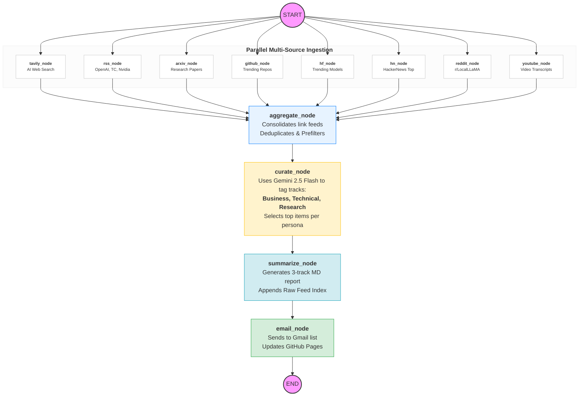

# GenAI News Agent: Intelligence Report v2

An automated, high-precision intelligence agent powered by **LangGraph** that curates, categorizes, and summarizes the top news in Generative AI into persona-specific tracks.

This agent doesn't just search the web; it performs a multi-source deep dive across specialized technical portals, "underground" forums, and research databases. It uses **Google's Gemini (2.5 Flash)** models to filter, tag, and report on the most impactful advancements with refined persona-based curation.

## Medium Blog Post Link: 
https://medium.com/@shubham.shardul2019/how-i-built-an-autonomous-multi-agentic-news-engine-full-implementation-ef09a2f00f33

## Website Link: 
https://shubhamshardul-work.github.io/Projects/GenAIReport/

## ✨ Key Features (v2 Upgrades)

- **Intelligence Report v2**: Automatically categorizes news into three specialized tracks:
  - **🏢 AI Business & Strategy**: For executives (M&A, corporate moves, regulation).
  - **🛠️ AI Architects & Developers**: For engineers (new models, local inference, fine-tuning).
  - **🔬 Research Frontiers**: For researchers (ArXiv breakthroughs, academic papers).
- **Expanded "Underground" Ingestion**:
  - **Reddit**: Scrapes top daily technical discussions from `r/LocalLLaMA`.
  - **HackerNews**: Pulls top trending AI stories and discussion scores.
  - **YouTube AI**: Fetches transcripts from top AI channels to capture insights from video content.
- **Raw Intelligence Index**: A collapsible database at the end of every report listing **all** gathered links (20-30+ items), ensuring zero data loss for power users.
- **Enriched Metadata**: 
  - **ArXiv**: Smart filtering to handle arXiv's 2-day publication lag.
  - **HuggingFace**: Summaries now include model tags and download trends.
- **Automated Newsletter Delivery**: Integrated Google Sheets subscriber management and Gmail automation.

## 🚀 How It Works



## 🛠 Local Development

1. **Clone the repository**
2. **Install dependencies**: `pip install -r requirements.txt`
3. **Environment Setup**: Create a `.env` file in the root with your API keys:
   ```env
   GOOGLE_API_KEY=your_key_here
   TAVILY_API_KEY=your_key_here
   GMAIL_USER=your_email (optional)
   GMAIL_APP_PASSWORD=your_app_password (optional)
   SUBSCRIBERS_SHEET_URL=your_google_sheet_csv_url (optional)
   ```
4. **Run the agent**:
   ```bash
   # Standard run (fetches last 2 days)
   python main.py
   
   # Custom recency window (e.g., last 24 hours)
   python main.py --days 1
   ```

## 📦 Output
- **`reports/`**: Human-readable Markdown reports organized by persona.
- **`state/`**: Full JSON state dump including `categorized_news` and `raw_news` for inspection.

## 🤖 GitHub Actions Deployment

The agent runs automatically every day at 8:00 AM IST (2:30 AM UTC).

1. Go to repository **Settings** > **Secrets and variables** > **Actions**.
2. Add the required API keys (GOOGLE, TAVILY) and optional email credentials.
3. Enable workflows in the **Actions** tab.
4. The action will generate reports, commit them, and trigger the GitHub Pages site rebuild.

